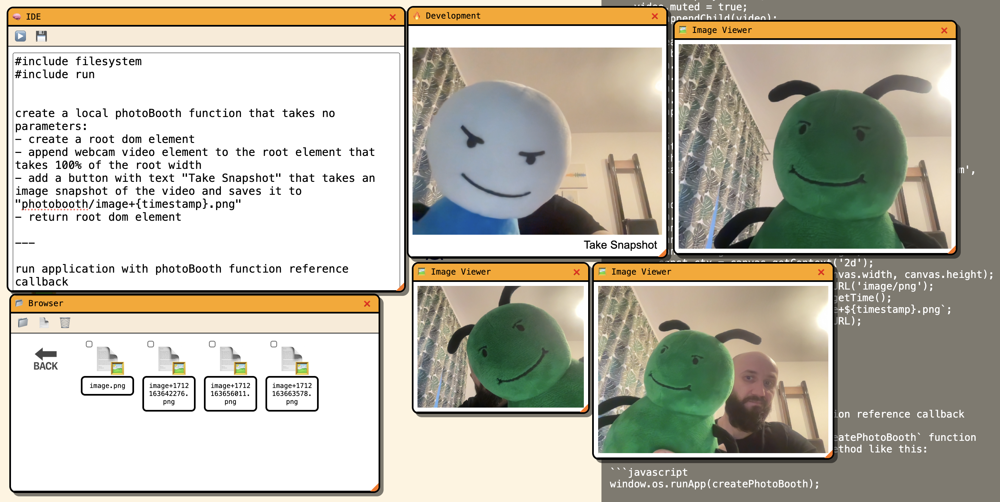

# 🏛️ TempLLM OS

`TempLLMOS` is a WebOS entirely described in natural language and seamlessly compiled into JavaScript using an LLM.


Outated animation of the OS


# 🥇 Sample
Here is how to code a PhotoBooth Application that takes snapshots and saves them into the Virtual FS
```
#include filesystem
#include run


create a local photoBooth function that takes no parameters:
- create a root dom element
- append webcam video element to the root element that takes 100% of the root width
- add a button with text "Take Snapshot" that takes an image snapshot of the video and saves it to "photobooth/image+{timestamp}.png"
- return root dom element

--- 
run application with photoBooth function reference callback
```



# 🏃‍➡️ Give it a try:

There are two working modes for the experimental os: Static runtime where the precompiled code is present and injected in the root HTML and the dynamic realtime compiler mode where a server that hosts a LLM model is published that allows the user to compile new apps at runtime.

- [Static Runtime on GitHub pages](https://cstefanache.github.io/templlmos/templlmos.html) [Ide & Run won't work]
- Static Runtime: Just open the `templllmos.html` file [Ide and Run won't work]
- Realtime Compiler: `python3 templlmos.py --serve --listen` and open `http://localhost:8080` in a browser 

For runtime compiler you need to install dependencies:

```
python3 -m pip install huggingface_hub llama-cpp-python watchdog
```

for MAC runtime you can benefit from GPU inference and install llama-cpp with METAL enabled:

```
CMAKE_ARGS="-DLLAMA_METAL=on" python3 -m pip install llama-cpp-python --upgrade --force-reinstall --no-cache-dir
```

## ✅ Next Steps

- [ ] Increase output stability
- [ ] Fix CPU vs. GPU generation differences
- [ ] Better WebUI
- [ ] Window Management & Taskbar
- [ ] Fine tune model on JS Only

## ❤️ Contribute

We believe in the power of collaboration and welcome contributions from developers of all skill levels. Whether it's fixing bugs, improving documentation, or suggesting new features, your help makes a big difference!